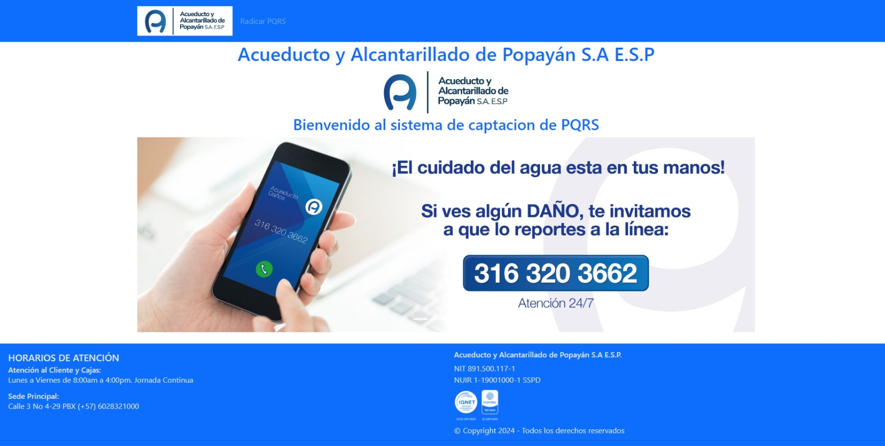
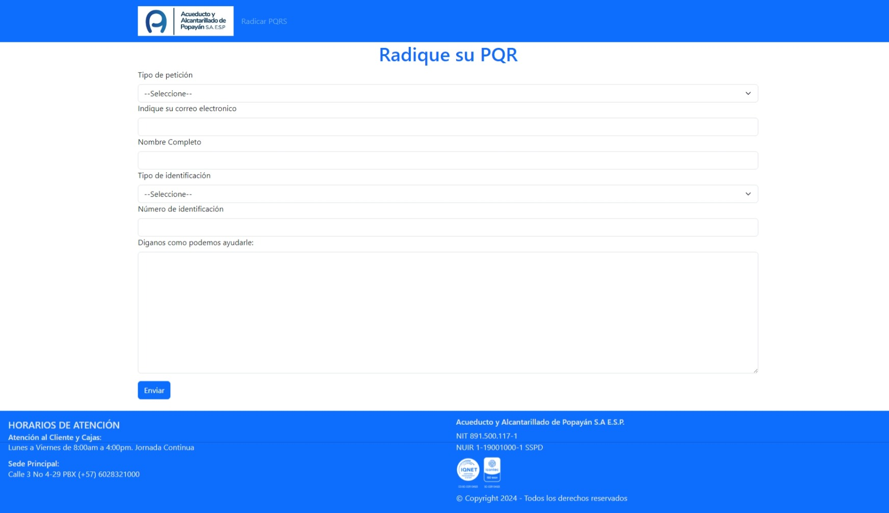
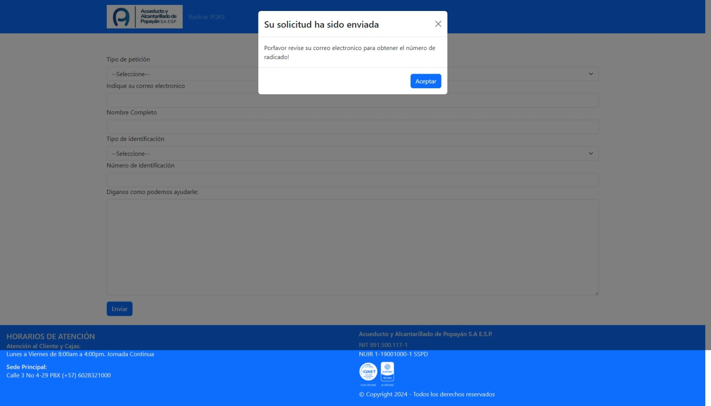

# Software de captacion de PQRS

## Pre requisitos

es necesario tener instalado `nodeJS` el cual se puede descargar desde la página oficial de [Node.JS](https://nodejs.org/en)

## Arrancando el proyecto

1. Una vez se haya instalado `NodeJS` es necesario abrir el proyecto en una terminal y ejecutar el comando `cd frontend`
para poder ingresar a la carpeta donde se encuentra el cliente

2. Dentro de la carpeta `Frontend` se debe ejecutar el comando `npm install`, esto instalará las dependencias necearias para poder correr 
el proyecto

3. Una vez instaladas todas las dependencias necesarias debemos correr el comando `npm run dev` en la terminal, esto levantará el proyecto dentro de la misma terminal podemos escribir la letra `o` y presionar la tecla `Enter` de esta forma nos abrirá el navegador por defecto con la página del proyecto

## Pantallazos del proyecto
### Landing page

### Formulario de radicación de PQRS

### Modal dentro del formulario de PQR

## Informacion de framework

### React + Vite

This template provides a minimal setup to get React working in Vite with HMR and some ESLint rules.

Currently, two official plugins are available:

- [@vitejs/plugin-react](https://github.com/vitejs/vite-plugin-react/blob/main/packages/plugin-react/README.md) uses [Babel](https://babeljs.io/) for Fast Refresh
- [@vitejs/plugin-react-swc](https://github.com/vitejs/vite-plugin-react-swc) uses [SWC](https://swc.rs/) for Fast Refresh
